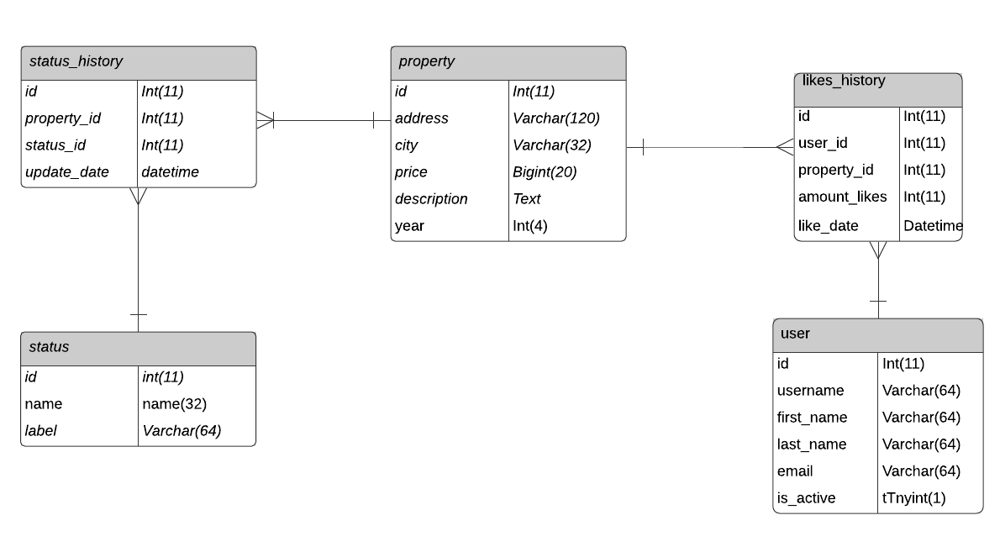
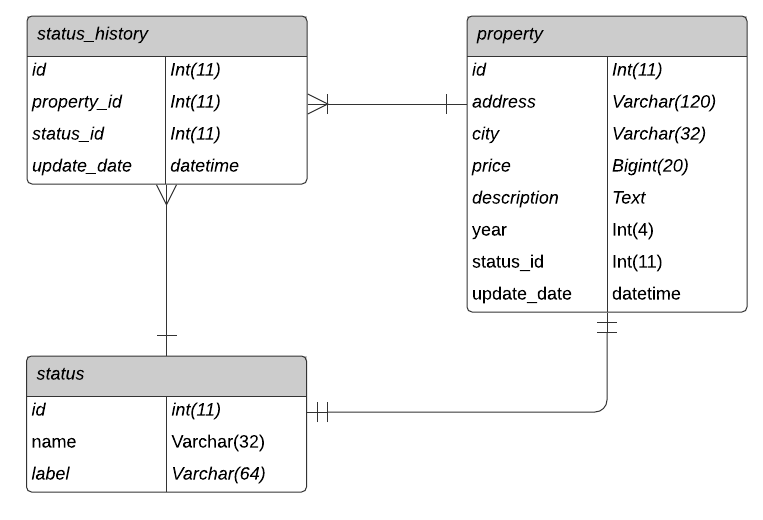

## TECHNICAL TEST API REST PYTHON

It's a simple REST API with Python 3.9

### Technologies

- [Python 3.9](https://www.python.org/downloads/)
- [mysql-connector-python](https://dev.mysql.com/downloads/connector/python/) allow connecting with the db in MYSQL
- [pytest](https://docs.pytest.org/en/latest/) for testing
- [django-environ](https://pypi.org/project/django-environ-2/) allow using environment variables in the project

### How I develop this project

I adopted the structure of [Django](https://www.djangoproject.com/) with twelve-factor-app methodology

First I created the structure of the application with the following structure:

- .envs store all the environment variables
- .gitignore store the files that I don't want to be committed
- DB allows connecting with the database
- manage.py is the main file of the project
- requirements.txt is the list of the packages that I need to install
- settings are the configuration for the project
- urls.py is the configuration of the URL
- views.py is the configuration of the views
- server is the configuration of the server

## Questions before creating this project
### What is the purpose of this project?
This project is a technical test to verify my knowledge in backend development with Python.
I created an API rest that allows the users to see the properties available in habi.co and allow them to give a like the favorites properties.
### How I can create an API without the use of frameworks?
Well, it's my first time creating an API without the use of any frameworks, but I know if the project is with Python, I can create anything.

### How to use

```bash
  python3 -m venv .env
  source .env/bin/activate
  pip install -r requirements.txt
```
Now in the folder .envs/.production add the credentials for the database.
```bash
    MYSQL_HOST=<your database host>
    MYSQL_PORT=<your database port>
    MYSQL_USER=<your database username>
    MYSQL_PASSWORD=<your database password>>
    MYSQL_DATABASE=<your database name>
```


```bash
  python3 manage.py
```

# Recipes
Method | URL | Description
------------- | ------------- | -------------
`GET` | `/properties` | Get all the properties with the status “pre_venta”, “en_venta” and “vendido”.
`GET`  | `/propertiesproperties?city=bogota&status=pre_venta&year=2021` | Get all the properties in the city “bogota” with the status “pre_venta” and the year “2021”.

# Relational model of like history

```sql
create table likes_history
(
	id int not null,
	user_id int not null,
	property_id int not null,
	amount_likes int not null,
	like_date datetime not null,
	constraint property__fk
		foreign key (property_id) references property (id),
	constraint user_id__fk
		foreign key (user_id) references auth_user (id)
);

create unique index likes_history_id_uindex
	on likes_history (id);

alter table likes_history
	add constraint likes_history_pk
		primary key (id);
````

### Why this relational model of like history?
- The database needs to be updated when a user likes a property and store the history of likes.
- The table likes_history has a relational with the table property and auth_user.
- We can use this table to know the number of likes of a property and the date when the user liked the property.
- If we'll need to know the last like of a property, we can use the column like_date to know the date of the last like.

# Proposal for a better relational model of properties
We can hold the history of the status of the property, but also we can create the column status_id and update_date on the table property 
that allow know the real status of the property and simplify the query when we need the real status and to avoid incorrect queries.


### Thank you HABI for the great experience.
